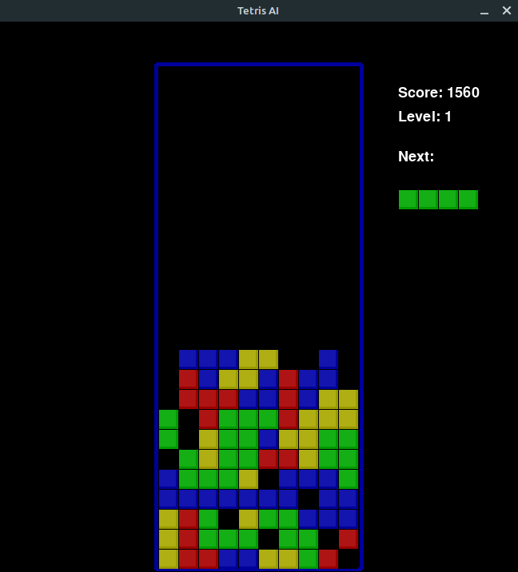

# Tetris AI 

## Screenshot
<div style="text-align:center"></div>

## Usage:
To run Tetris AI with optimal parameters:
```
python3 main.py
```

To run GA training:
```
python3 main.py --train --no-show
```

To run base game:
```
python3 main.py --game
```

## References:
- https://github.com/jgardner8/genetic-tetris-ai
- https://codemyroad.wordpress.com/2013/04/14/tetris-ai-the-near-perfect-player/
- https://luckytoilet.wordpress.com/2011/05/27/coding-a-tetris-ai-using-a-genetic-algorithm/
- https://medium.com/@omgimanerd/building-a-tetris-bot-part-2-genetic-algorithms-889fc66006b1
- http://inventwithpython.com/pygame/chapter7.html
- https://github.com/brunoxd13/ag-tetris
